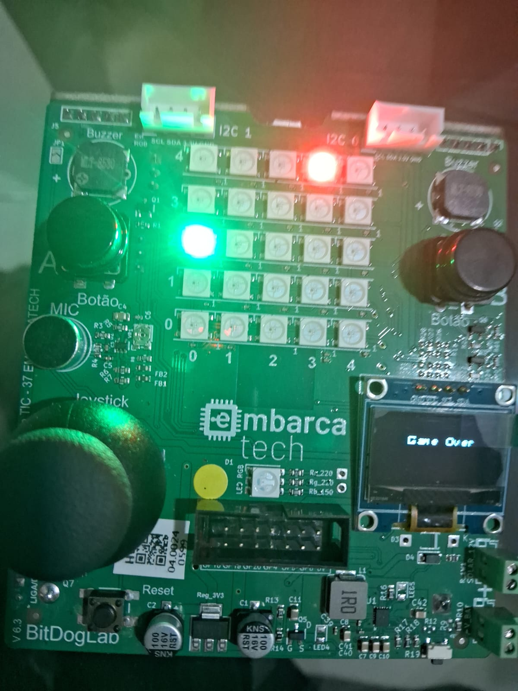

🎯 Objetivo do projeto

- O Projeto tem como objetivo repetir o jogo de celular que minha vó tinha no celular
🧩 Componentes usados

- Placa BitDogLab (Raspberry Pi Pico W)
- Display OLED SSD1306
- Matriz de LEDs WS2812B
- LED RGB
- Buzzer passivo
- Joystick analógico

⚡ Pinagem dos dispositivos

- PINO_BUZZER 21 **Pino do buzzer**
- PINO_LED 13 **Pino do LED indicador**
- PINO_MICROFONE 28 **Pino do microfone**
- PINO_MATRIZ_LED 7 **Pino da matriz de LEDs**
- PINO_LED_RGB 11 **Pino do LED RGB**

🧪 Como compilar e executar
1. Instalar as dependências: **SDK do Raspberry Pi Pico**, **CMake**, **Compilador GCC para ARM**, entre outros.  
2. Configurar o **VS Code** com as extensões **C/C++** e **Raspberry Pi Pico Project**.  
3. Incluir as bibliotecas necessárias, como `hardware/dma.h`, `hardware/pwm.h`, `hardware/pio.h` e `ws2818b.pio.h`.  
4. Compilar o código usando CMake e gerar o arquivo `.uf2`.  
5. Conectar a placa ao PC via USB, entrar no modo **BOOTSEL**, e copiar o arquivo `.uf2` para a unidade montada. 

🖼️ Imagens e vídeos

📈 Resultados esperados ou observados

O projeto foi conclúido com sucesso, seguindo os principios ensinados na fase 1 utilizando materiais e ferramentas oferecidos pela disciplina